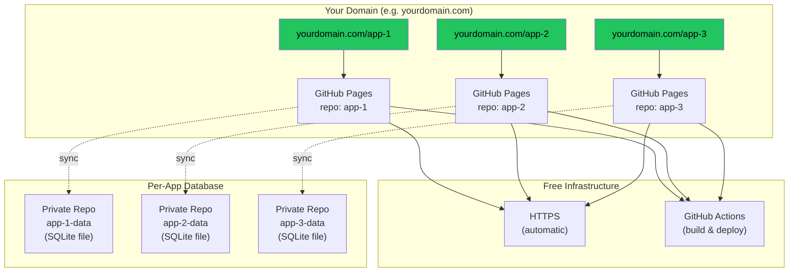
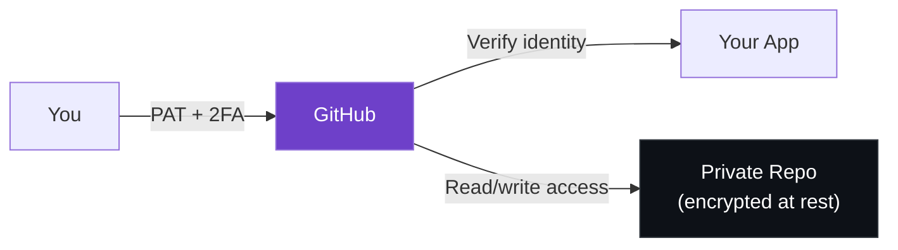
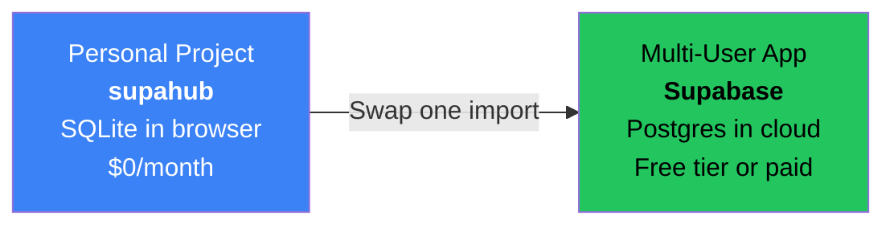

# supahub

Drop-in Supabase replacement backed by SQLite WASM. Same API, zero backend, free forever.

## The Problem

I build a lot of personal apps. My workflow was always: create a Supabase project, build the frontend, deploy. But Supabase's free tier limits how many active projects you can have. I kept hitting the wall — pausing old projects to start new ones, or paying for capacity I didn't need.

I wanted something simpler: **start building immediately with the Supabase API I already know, get a fully working app with zero cost, and upgrade to real Supabase later if the project ever needs multi-user support.**

supahub is that starting point. It's the same API, backed by SQLite in your browser instead of a Postgres server. When you're ready to scale, swap one import and you're on Supabase. Until then, everything is free.

## The Free Stack

When you combine supahub with GitHub Pages, you get a complete app platform for $0/month:



**What you get for free — per app, unlimited apps:**

| Layer | Provider | Cost |
|-------|----------|------|
| Git repo | GitHub | Free |
| Frontend hosting | GitHub Pages | Free |
| HTTPS | GitHub Pages | Free (automatic) |
| CI/CD | GitHub Actions | Free |
| Database | supahub (SQLite WASM in browser) | Free |
| DB persistence | OPFS / IndexedDB | Free |
| DB backup + sync | GitHub API (private repo) | Free |
| Version history | Git commits on the SQLite file | Free |
| Custom domain | Point your domain to GitHub Pages once | Free |
| Auth | GitHub PAT (backed by GitHub's 2FA) | Free |

Map your domain to your GitHub Pages user site once (`yourdomain.com` → `username.github.io`), and every project repo automatically gets its own URL at `yourdomain.com/repo-name`. No DNS changes per app. No hosting config. Just push code.

### Security

Auth is a GitHub Personal Access Token. That means your app is protected by GitHub's full security stack — 2FA, session management, token expiration, fine-grained scopes — without writing a single line of auth code. The same token that authenticates you also syncs your data to a private repo that only your GitHub account can access. No passwords to manage, no auth server to maintain, no attack surface beyond GitHub itself.



## The Upgrade Path

supahub uses the exact same API as `@supabase/supabase-js`. This is intentional — your service layer code is a migration-ready asset, not throwaway prototyping code.



```diff
- import { initDb, createClient } from "supahub";
- await initDb({ schema: mySchema });
- const supabase = createClient();
+ import { createClient } from "@supabase/supabase-js";
+ const supabase = createClient(url, key);
```

Everything else — every `.from().select().eq()`, every `.upsert()`, every `.rpc()` — stays the same.

## What is this?

supahub lets you replace `@supabase/supabase-js` with a local SQLite database that runs entirely in your browser. Your existing Supabase queries keep working — no code changes needed in your service layer.

**Before:**

```ts
import { createClient } from "@supabase/supabase-js";
const supabase = createClient(url, key);
```

**After:**

```ts
import { initDb, createClient } from "supahub";
await initDb({ schema: "CREATE TABLE IF NOT EXISTS todos (...)" });
const supabase = createClient();
```

Everything else stays the same. Your `.from().select().eq().order()` chains, your `.upsert()` calls, your `.rpc()` functions — they all just work.

## Why?

- **Unlimited projects** — no Supabase free tier limits
- **Free forever** — no server, no database bills, no rate limits
- **Offline-first** — works without internet, data lives in your browser
- **Private** — your data never leaves your device (unless you sync it)
- **Fast** — SQLite is faster than network round-trips to Supabase
- **Zero migration effort** — same API, swap one import when you're ready to scale

## How it works

```
Your App
  │
  ├── supabase.from("todos").select("*").eq("done", false)
  │         │
  │         ▼
  │   ┌─────────────┐
  │   │  supahub     │  ← Translates chainable API to SQL
  │   │  query       │
  │   │  builder     │
  │   └──────┬──────┘
  │          ▼
  │   ┌─────────────┐
  │   │  sql.js      │  ← SQLite compiled to WASM
  │   │  (SQLite)    │
  │   └──────┬──────┘
  │          ▼
  │   ┌─────────────┐
  │   │  OPFS / IDB  │  ← Persistent browser storage
  │   └──────┬──────┘
  │          ▼
  │   ┌─────────────┐
  │   │  GitHub API  │  ← Optional backup/sync (free)
  │   └─────────────┘
```

## Install

```bash
npm install supahub
```

You also need the sql.js WASM file in your static/public directory:

```bash
cp node_modules/sql.js/dist/sql-wasm.wasm public/
```

## Quick Start

### 1. Initialize the database

```ts
import { initDb, createClient } from "supahub";

await initDb({
  wasmUrl: "/sql-wasm.wasm",
  schema: `
    CREATE TABLE IF NOT EXISTS todos (
      id TEXT PRIMARY KEY,
      text TEXT NOT NULL,
      done INTEGER DEFAULT 0,
      created_at TEXT DEFAULT (datetime('now'))
    );
  `,
});

export const supabase = createClient({
  columns: {
    bool: ["done"],
  },
});
```

### 2. Use exactly like Supabase

```ts
// Select
const { data, error } = await supabase
  .from("todos")
  .select("*")
  .eq("done", false)
  .order("created_at", { ascending: false });

// Insert
const { data: newTodo } = await supabase
  .from("todos")
  .insert({ id: crypto.randomUUID(), text: "Buy milk" })
  .select()
  .single();

// Update
await supabase
  .from("todos")
  .update({ done: true })
  .eq("id", todoId);

// Delete
await supabase
  .from("todos")
  .delete()
  .eq("id", todoId);

// Upsert
await supabase
  .from("todos")
  .upsert({ id: existingId, text: "Updated text", done: false });

// Upsert with custom conflict target
await supabase
  .from("metrics")
  .upsert(row, { onConflict: "user_id,date" });
```

### 3. Optional: Sync to GitHub

Back up your database to a private GitHub repo for free. The entire SQLite database is stored as a single file, with full version history via git commits.

```ts
import { configureSync, push, pull, setupAutoSync } from "supahub";

// Configure once
configureSync({
  token: "ghp_your_personal_access_token",
  repo: "yourname/my-app-data",
  path: "app.sqlite", // optional, default: "supahub.sqlite"
});

// Pull latest on startup
await pull();

// Push after changes
await push();

// Or set up auto-sync (debounced push 30s after writes, immediate push on tab close)
setupAutoSync();
```

## API Reference

### Database

#### `initDb(options?)`

Initialize the SQLite database.

```ts
await initDb({
  wasmUrl: "/sql-wasm.wasm",     // Path to WASM file
  filename: "myapp.sqlite",       // OPFS/IDB storage name
  schema: "CREATE TABLE ...",     // SQL to run on init
  onSave: () => schedulePush(),   // Callback after every write
});
```

#### `getDb()`

Get the raw sql.js `Database` instance for advanced queries.

#### `run(sql, params?)` / `queryAll(sql, params?)` / `queryOne(sql, params?)`

Execute raw SQL when you need to go beyond the Supabase API.

```ts
import { queryAll } from "supahub";
const results = queryAll("SELECT * FROM todos WHERE text LIKE ?", ["%milk%"]);
```

#### `exportBytes()` / `importBytes(data)`

Export/import the entire database as a `Uint8Array`. Useful for backup, sync, or migration.

### Client

#### `createClient(options?)`

Create a Supabase-compatible client.

```ts
const supabase = createClient({
  columns: {
    json: ["metadata", "tags"],   // Auto JSON.parse/stringify
    bool: ["is_active", "done"],  // Auto 0/1 ↔ true/false
  },
  rpc: {
    my_function: (params) => {
      // Custom RPC implementation
      const results = queryAll("SELECT ...", [params.limit]);
      return { data: results, error: null };
    },
  },
});
```

### Query Builder

The query builder supports the following Supabase methods:

| Method | Description |
|--------|-------------|
| `.from(table)` | Set the target table |
| `.select(columns?)` | SELECT query (default: `*`) |
| `.insert(data)` | INSERT one or many rows |
| `.upsert(data, opts?)` | INSERT ... ON CONFLICT DO UPDATE |
| `.update(data)` | UPDATE rows |
| `.delete()` | DELETE rows |
| `.eq(col, val)` | WHERE col = val |
| `.neq(col, val)` | WHERE col != val |
| `.gt(col, val)` | WHERE col > val |
| `.gte(col, val)` | WHERE col >= val |
| `.lt(col, val)` | WHERE col < val |
| `.lte(col, val)` | WHERE col <= val |
| `.order(col, opts?)` | ORDER BY (default: ascending) |
| `.limit(n)` | LIMIT n |
| `.single()` | Return exactly one row or error |
| `.maybeSingle()` | Return one row or null |

All queries return `{ data, error }` just like Supabase.

### GitHub Sync

| Function | Description |
|----------|-------------|
| `configureSync(opts)` | Set token, repo, and file path |
| `push()` | Upload database to GitHub |
| `pull()` | Download latest database from GitHub |
| `getSyncStatus()` | Check sync config and timestamps |
| `schedulePush()` | Debounced push (30s delay, resets on each call) |
| `setupAutoSync()` | Auto-push on tab close/hide |

## Migrating from Supabase

### Step 1: Export your data

Use the Supabase dashboard or API to export your tables as JSON.

### Step 2: Create your schema

Translate your Supabase tables to SQLite CREATE TABLE statements. Key differences:
- No `user_id` columns needed (single-user, no RLS)
- Use `TEXT` instead of `uuid`
- Use `TEXT` instead of `jsonb` (supahub handles JSON serialization)
- Use `INTEGER` instead of `boolean`
- Use `REAL` instead of `numeric`
- Singleton tables can use `CHECK (id = 1)` to enforce one row

### Step 3: Swap the import

```diff
- import { createClient } from "@supabase/supabase-js";
- const supabase = createClient(url, key);
+ import { initDb, createClient } from "supahub";
+ await initDb({ schema: mySchema });
+ const supabase = createClient({ columns: { json: [...], bool: [...] } });
```

### Step 4: Remove Supabase

```bash
npm uninstall @supabase/supabase-js
```

Your service layer code stays exactly the same.

## What's supported

- `from().select().eq().gte().lte().order().limit().single().maybeSingle()`
- `from().insert().select().single()`
- `from().upsert()` with `onConflict`
- `from().update().eq()`
- `from().delete().eq()`
- `rpc()` with custom handlers
- `functions.invoke()` (stub — returns error)
- `auth.*` (stub — bring your own auth)
- Thenable queries (`await supabase.from(...).select(...)`)
- Multiple `.order()` calls
- Chained `.eq()` filters (AND)

## What's not supported (yet)

- `.or()`, `.in()`, `.is()`, `.like()`, `.ilike()`
- `.range()` for pagination
- `.textSearch()`
- Realtime subscriptions
- Storage API
- Row-Level Security (not needed for single-user apps)

## Persistence

supahub persists your database automatically after every write:

1. **OPFS** (Origin Private File System) — preferred, survives cache clears
2. **IndexedDB** — fallback for browsers without OPFS support

Both are transparent — you don't need to think about persistence.

## Architecture

supahub is intentionally simple:

- **`db.ts`** — SQLite singleton via sql.js WASM
- **`query-builder.ts`** — Translates Supabase chainable API to SQL
- **`client.ts`** — Creates the Supabase-compatible client object
- **`opfs.ts`** — OPFS + IDB persistence layer
- **`github-sync.ts`** — GitHub Contents API sync

Total: ~600 lines of TypeScript. No dependencies beyond `sql.js`.

## Requirements

- Modern browser with WASM support (all major browsers since 2017)
- HTTPS for OPFS (localhost works for development)

## License

MIT
